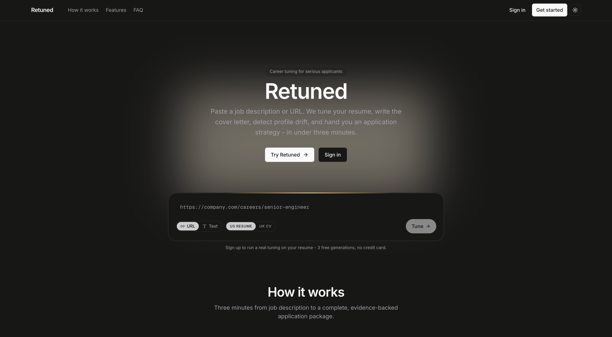

# Retune

> AI-assisted job application platform that generates tailored, fully traceable resume packages through a specialist-driven agent runtime.

Retune is a monorepo combining a Next.js product UI, a Hono cognitive API, a Temporal worker, an ML service, and a specialist-driven agent runtime. Instead of treating resume tailoring as template-filling, Retune models it as a multi-specialist reasoning problem: specialists collaborate over a shared blackboard, every decision is traced, and the final output can be explained.



---

## Why Retune

Most job-application tools optimize for keyword matching, not for how a hiring manager actually reads a resume. Tailoring well requires understanding the role, understanding the candidate's career, finding the genuine overlap, resolving conflicts, and shipping only when the output clears a quality bar — a cognitive pipeline rather than a template engine.

Retune is built around that pipeline. The longer-term bet is that proprietary outcome data and a compounding per-user career graph form a moat that a general foundation model alone cannot replicate.

---

## Contributors

| Author | Responsibility |
|--------|----------------|
| **Komal Andharikar** | Product vision, business PRD, product charters (`docs/charters/`), and design specifications (`docs/design-system.md`) |
| **Shubham Kanse** | Software architecture and full implementation (`packages/`, `apps/`), ADRs (`docs/adr/`), test scenarios, and dev onboarding |

---

## Architecture

| Path | Purpose |
|------|---------|
| `apps/web` | Next.js 15 application — UI plus API proxy routes for auth, onboarding, generation, profile, and files |
| `apps/api` | Hono service exposing cognitive generation endpoints (`/generate`, `/generate/:id/stream`, `/generate/:id`, `/generate/:id/*`) |
| `apps/worker` | Temporal worker that runs durable workflows and activities |
| `apps/ml` | FastAPI + optional gRPC service for embeddings, span extraction, and discourse classification |
| `packages/agent` | Core cognitive runtime — orchestrator, blackboard, specialists, persistence, Temporal glue |
| `packages/db` | Drizzle + Postgres/PGlite schema and database helpers |
| `packages/types` | Shared cognitive and data contracts |
| `packages/auth`, `packages/billing`, `packages/eval`, `packages/proto`, `packages/ui`, `packages/onto` | Supporting packages |

### Request lifecycle

1. `apps/web` sends a generation request and proxies it to `apps/api`.
2. `apps/api` starts one of two paths:
   - the **Temporal workflow** path (`runGenerationWorkflow`) when Temporal is configured, or
   - an **in-memory workbench runtime** fallback.
3. `packages/agent` runs specialists over a shared blackboard.
4. `apps/api` streams trace events over SSE and serves final results and downloads.
5. Persistence is handled by `packages/db` together with `packages/agent` persistence adapters.

---

## Quick Start

### Prerequisites

- Node.js 22+
- `pnpm` 10+
- Docker (recommended for Postgres)
- Python 3.11+ (required by `apps/ml` and document generation)

### Setup

```bash
# Clone
git clone <your-repo-url>
cd retune

# Install dependencies
pnpm install

# Set up Python environment for the ML service / document generation
# (see apps/ml/README for details)

# Start infra and run migrations
pnpm db:up
pnpm db:migrate

# Run all apps
pnpm dev
```

To run a subset of apps:

```bash
pnpm dev:lite
```

---

## Scripts

| Command | Description |
|---------|-------------|
| `pnpm dev` | Run all monorepo apps via Turbo |
| `pnpm dev:lite` | Run a subset of apps |
| `pnpm build` | Build all packages and apps |
| `pnpm test` | Run all test suites |
| `pnpm lint` | Run Biome checks |
| `pnpm db:migrate` | Run database migrations |

---

## Environment Variables

| Variable | Description |
|----------|-------------|
| `RETUNE_TEMPORAL` | Enable the Temporal workflow path |
| `RETUNE_TEMPORAL_ADDRESS` | Temporal server address |
| `RETUNE_TEMPORAL_NAMESPACE` | Temporal namespace |
| `RETUNE_PERSIST` | Persistence driver: `pglite` or `postgres` |
| `RETUNE_DATABASE_URL` | Database connection string |
| `AI_PROVIDER` | AI provider: `anthropic` or `openai` |
| `RETUNE_ML_TRANSPORT` | ML service transport |
| `RETUNE_ML_BASE_URL` | ML HTTP base URL |
| `RETUNE_ML_GRPC_BASE` | ML gRPC base URL |

---

## Documentation

| Document | Description |
|----------|-------------|
| `docs/charters/` | Product charters across all domains |
| `docs/adr/` | Architecture Decision Records |
| `docs/test-scenarios/` | End-to-end test scenario definitions |
| `docs/design-system.md` | Design system specification |
| `docs/dev-onboarding.md` | Developer onboarding guide |

---

## Project Status

The repository contains two surfaces:

- the **active cognitive substrate** (`packages/agent` + `apps/api` + `apps/worker`), which is authoritative for generation execution, and
- **legacy/compatibility surfaces** in parts of the `apps/web` APIs and UI flows.

For a full map of where those boundaries sit and which path owns generation, see the architecture map in `docs/` <!-- link the exact file, e.g. docs/architecture-map.md -->.

---

## Tooling: Understand Anything

This repo is wired for **Understand Anything**, a code-comprehension tool that builds a queryable knowledge graph of the codebase.

```bash
pnpm understand:check      # Verify setup
pnpm understand:analyze    # Generate / refresh the knowledge graph
pnpm understand:dashboard  # Start the dashboard (expects .understand-anything/knowledge-graph.json)
```

Generated artifacts live under `.understand-anything/`: `knowledge-graph.json`, `meta.json`, `fingerprints.json`, and `.understandignore`.

---

## License

<!-- Add a license. MIT is a common default for portfolio/open-source projects. -->
This project is licensed under the terms of the [LICENSE](LICENSE) file.